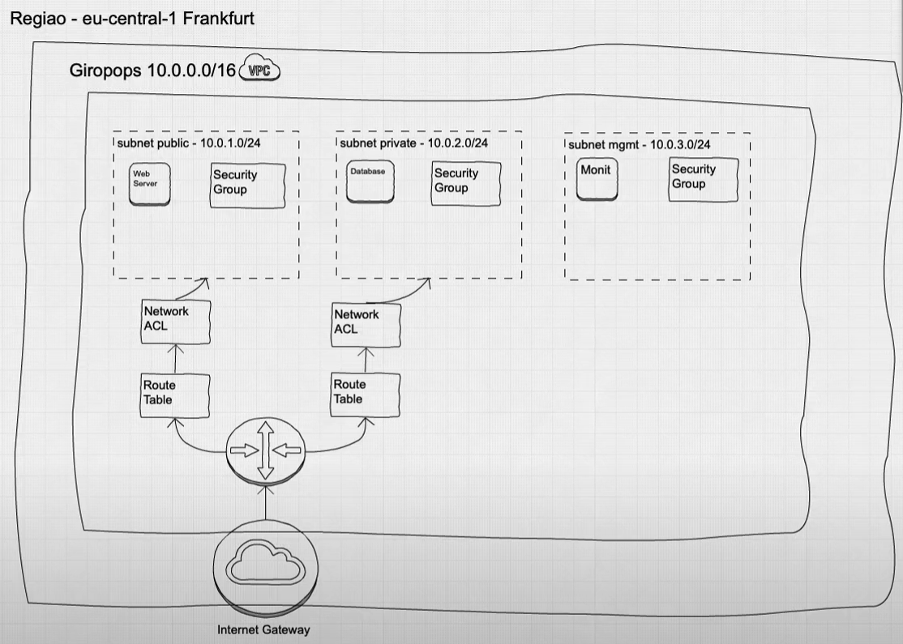

# Aws Expert 2.0 LinuxTips

```https://school.linuxtips.io/courses```

## Day 08

### Links

VPC => https://docs.aws.amazon.com/pt_br/vpc/latest/userguide/VPC_Subnets.html

Calculadora Subnet => http://www.subnet-calculator.com/

Internet Gateway => https://docs.aws.amazon.com/pt_br/vpc/latest/userguide/VPC_Internet_Gateway.html

Route Tables => https://docs.aws.amazon.com/pt_br/vpc/latest/userguide/VPC_Route_Tables.html


###

Internet Gateway > route table > Network acl > Security Groups
